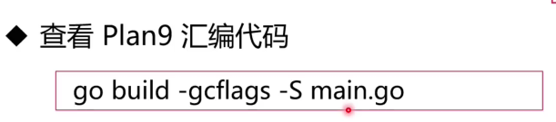
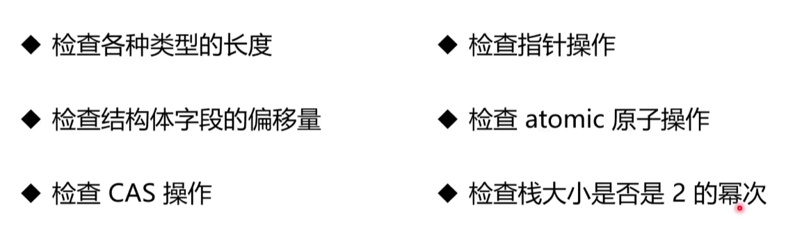
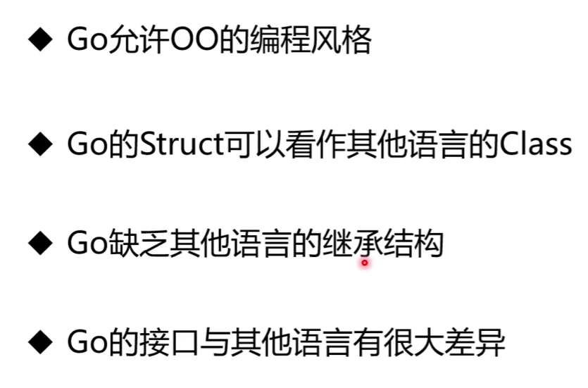
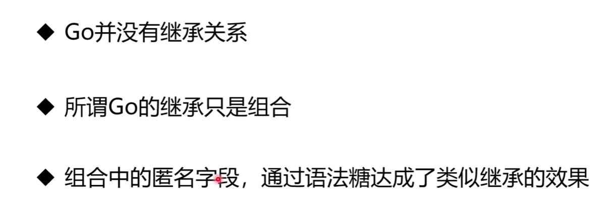

# Go重写Redis

# Runtime

## Runtime概念

```
Runtime:程序的运行环境
Java的Runtime:java虚拟机
JavaScript的Runtime:浏览器内核
```

```
Go没有虚拟机，Go的Runtime就是作为程序的一部分打包进二进制的产物
它被编译为随用户程序一起运行，可以被调用。

Go代码+Runtime---->Binary
```

## Runtime的作用

```
1.内存管理能力
2.垃圾回收能力：GC
3.超强并发能力

一些Go的关键字其实就是Runtime的函数：
比如创建协程的关键子go----->对应Runtime的newproc函数
new----->newobject
```

## Go程序如何编译

```
词法分析---》句法分析---》语义分析----》中间码生成----》代码优化----》机器码生成-----》链接
```

!.[GoRedis.assets/image-20220606150015781.png](https://github.com/dyzxzw/go-redis/blob/master/GoRedis.assets/image-20220606150015781.png))

## 中间码生成（SSA)

```go
//为了处理不同平台的差异，先生成与平台无关的中中间代码SSA，类似汇编
//可以通过指令查看：
//Win下：
$env:GOSSAFUNC="main"  //你要查看的函数是main
go build  //会生成ssa.html，可以看到SSA代码

//Linux下：
export GOSSAFUNC=main
go build
```

## 机器码生成



## Go程序的入口

```
1.入口不是main方法
而是runtime下的rt0_XXX.s文件，它是汇编语言
```

```
2.读取命令行参数，复制参数数量argc和参数值argv到栈上

3.初始化go执行栈：go是为了调度协程而产生的协程，它是母协程，是Go程序的第一个协程。
```

```
4.运行时检测
```



## Go是面向对象的语言吗



```go
type People struct{
    Name string
    Age int
}
func(p People)Walk(){
    
}
type Man struct{
    People //zu'he
}
func main(){
    m:=Man{}
    m.walk()
    //这个不是继承，只是组合，虽然和接口看起来类似
    //等价于 m.Man.People.Walk(),是Go的语法糖
}
```


